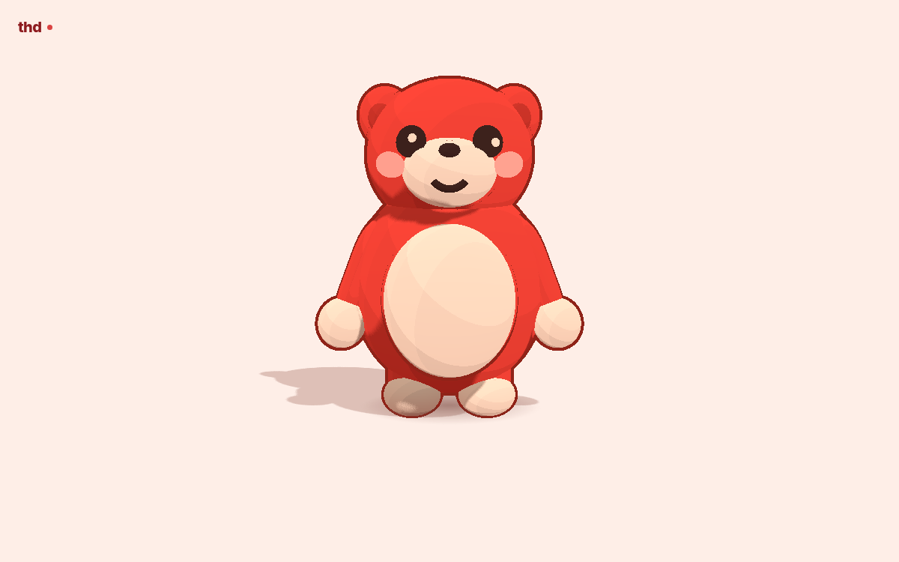

<p align="center">
  
</p>

<h1 align="center">Red Teddy</h1>

<p align="center">
  An interactive 3D teddy bear that lives in a web page.<br>
  Built with three.js. No React, no framework — just the renderer.
</p>

<p align="center">
  <a href="#live">Live site</a> ·
  <a href="#interactions">Interactions</a> ·
  <a href="#how-it-works">How it works</a> ·
  <a href="#running-it">Run it locally</a>
</p>

---

<a id="live"></a>
## Live site

**[thd.themostpoordev.top](https://thd.themostpoordev.top)**

Served as a static bundle from nginx with a Let's Encrypt certificate. It
loads in about 134 KB of JavaScript — 8 KB of scene code and 126 KB of
three.js — and runs at the display's native pixel ratio on every device.

<a id="interactions"></a>
## Interactions

Nothing here is hover-gated. Every response is reachable with a single tap,
so the whole thing works identically on a phone, a tablet and a desktop.

| Gesture | What happens |
|---|---|
| Tap the head | Hearts float up, the bear recoils and raises its arms |
| Stroke across the head | The head turns into your hand and drops, the ears go soft, the eyes half-close and the whole body relaxes |
| Squeeze the belly | The belly squashes and the arms fold in until the paws rest on it |
| Tap the floor | The bear hops over to that spot |
| Drag the bear | Pick it up and move it around |

Left alone, the bear breathes, blinks on a randomised schedule, and swivels
its ears out of phase with its breathing. It does not follow the pointer —
nothing moves it but a touch, which is what lets each gesture above read.

### Telling a tap from a stroke

The head has two gestures, and telling them apart is the whole difficulty of
the feature. A pet is not a repeated pat: someone stroking a bear moves
slowly and continuously, while tapping means picking it out of the air.

The split is on **distance travelled**, not speed. At 60 fps one frame is
16.7 ms, and a real stroke across a head this size moves only a few pixels
per frame — too little for a per-frame speed test to catch. A slow,
deliberate stroke is exactly the case such a test would miss, and it is the
case that most needs to work.

The threshold is 22% of the head's own width, measured by projecting the
head's bounding box through the live camera. A fraction of the *canvas*
was the obvious choice and it is wrong: the aspect ratio changes with the
viewport, so one fraction meant 35% of the head on a wide desktop and 10%
of it on a tall phone. Every tap became a pet on one and no stroke was ever
recognised on the other.

<a id="how-it-works"></a>
## How it works

### The character is maths, not models

There is no mesh file. The bear is about twenty spheres and capsules sharing
three materials, which is why the whole payload is small and why the code is
readable. Every animatable part is held in an explicit `rig` object, so
reactions address parts by name in constant time rather than walking the
scene graph.

### One file for every dimension

All of the numbers that define the character's shape live in
`src/bear/proportions.ts` and nowhere else. They are interdependent in ways
that are invisible from any single use site — the arm's outward angle only
makes sense against the torso's width, the eye's `x` against the skull's
radius, the mouth's width against the muzzle — so collecting them is what
makes them checkable.

Several of them are solved rather than chosen, and the arithmetic is in the
file. The belly press is the clearest case: a paw is 0.66 from the shoulder
while the front of the belly is 0.87 away, so a head-on hug is geometrically
impossible and the gesture has to land on the belly's *side*, where the
surface curves back toward the arm. The angles in `ARM_PRESS` are the
solution to that, found by scanning and then checked against the torso so
the limb does not pass through the body on the way.

### Flat things have to follow the curve

Placing the eyes and the blush was the hardest problem in this project, and
it failed three times before it was solved. The head is an ellipsoid, so its
surface curves away in every direction, and a flat disc placed at a fixed `z`
with a guessed rotation ends up half-buried — its outer edge inside the fur
while the middle floats clear.

The fix is to stop guessing. For an ellipsoid with radii `r`, the surface
height and the surface normal at a point are both closed-form:

```
z = rz · sqrt(1 - (x/rx)² - (y/ry)²)
n = normalize(x/rx², y/ry², z/rz²)
```

Every flat part on the face is positioned with those two values and laid along
the resulting normal. That is the difference between a sticker floating in
front of a head and a button sewn onto it. See `src/bear/ellipsoid.ts`.

Each side is computed from **its own** `x`. The skull is symmetric in `x`, so
the two eyes are mirror images in position and nearly mirror images in
normal — and "nearly" is not "exactly". Reusing one side's values for the
other is what made one eye sit flush on the cheek while the other hung off
the side of the head.

### The mouth is a solved curve, not a drawn one

A teddy bear's mouth is a shallow smile, and a torus arc makes that a matter
of arithmetic. For radius `R` swept over `arc` radians:

```
width = 2R · sin(arc/2)          dip = R · (1 - cos(arc/2))
```

The shape is fixed by `dip/width`, independent of `R`, and dividing the two
gives `dip/width = tan(arc/4) / 2`. A half-torus — `arc = π` — is the most
curved shape available for a given width, at exactly 0.5, and that is why a
half-circle reads as a bucket. The mouth uses a ratio of 0.25 instead.

Two things about the arc are easy to get wrong, and both were:

- The sweep **starts at angle 0**, so its midpoint sits at `arc/2`, not on
  the y axis. At `arc = π` that lands on 90° by luck, which is why the
  original half-torus came out symmetric with no correction. Any other arc
  does not, and the smile came out visibly crooked until the mouth was
  rotated by `(π - arc)/2` to re-centre it.
- The corner clearance is tight. The arc's ends have to stay below the
  nose's lower edge, which is what fixes the node's height.

### Toon shading without post-processing

The flat cel-shaded look comes from `MeshToonMaterial` with a 4×1
`DataTexture` gradient map using `NearestFilter`, which quantises the light
ramp into hard bands. The ink outline is an inverted hull — a second copy of
each mesh with `BackSide`, scaled outward — so it costs one extra draw call per
part and no full-screen pass, which is what lets it survive on a phone.

The hull's width is absolute rather than proportional. A fixed multiplier
(scale by 1.03 whatever the size) makes a big torso outline many times
heavier on screen than a thin arm's, because the same multiplier on a
smaller radius is proportionally less world space — which leaves the limbs
with a barely-visible line and the body heavily outlined.

### Native resolution, no quality dial

The renderer uses the device's pixel ratio verbatim rather than the usual
`min(devicePixelRatio, 2)`. The outline is one or two pixels wide on screen, so
it is exactly the element that shows the difference between native and clamped
resolution — clamping is what makes edges look soft. The cost argument for
clamping does not hold here either: there are no textures, no environment map
and no post-processing, so a frame is a few dozen flat triangles.

`antialias` is off for the same reason. On a 2× or 3× screen the buffer is
already supersampled relative to the output, which is strictly more samples per
pixel than MSAA applied at 1×, and it costs nothing.

### Springs have to be integrated, not eased

Most of the character moves through `damp()`, an exponential approach, which
is cheap and stable at any frame rate. The head during a stroke does not: it
runs on an explicit spring, because weight comes from momentum and an
exponential ease has none. The head carries past the hand and settles back,
which is what a head with mass looks like.

An explicit spring is only stable while `dt` stays small — at `k = 90` that
is about 1/9 s, and the frame clock clamps to 1/20 s, which is already past
it. Any backgrounded tab, slow frame or heavy moment on a phone exceeds that,
and an unstable spring never recovers: the value grows, the correction grows
with it, and the head shivers around its target forever. The spring is
therefore integrated in fixed 1/120 s substeps, so every step is well inside
the limit whatever the frame rate.

Two other timing rules the reactions follow:

- The pet's level is **re-asserted on every move**, not set once and decayed.
  A stroke is sustained contact, not an impulse; the response should hold for
  as long as the hand is there, and the decay exists to carry the release.
- A release uses a **stiffer spring** than an arrival. The head should feel
  heavy as it turns toward a hand and promptly let go when the hand leaves.

### Frame loop hygiene

- Delta time is clamped to 1/20 s, so returning to a backgrounded tab resumes
  as if only one slow frame had passed — otherwise every spring in the scene
  integrates a multi-minute step and the bear teleports.
- Rendering stops entirely while the tab is hidden.
- Hearts come from a pre-allocated pool. Allocating geometry mid-interaction
  is exactly what causes the hitch you feel when poking a particle-heavy scene
  on a phone.
- Nothing allocates in the render loop; scratch vectors are reused.

### Accessibility

- The hints are real DOM text, not a canvas overlay, so a screen reader can
  read them and they survive 200% zoom.
- The canvas carries a descriptive `aria-label`.
- `prefers-reduced-motion` is honoured and live-updated: it stops the
  breathing, blinking and hearts while leaving the character interactive. The
  user can change the setting while the page is open and it takes effect.
- Every colour token is contrast-checked against the background. Nothing under
  18px uses the accent red.

<a id="running-it"></a>
## Running it

Requires Node 20 or newer.

```bash
git clone https://github.com/themostpoordev/red-teddy.git
cd red-teddy
npm install
npm run dev
```

Then build the static bundle:

```bash
npm run build     # typecheck + bundle into dist/
npm run preview   # serve dist/ locally to check the production build
```

`dist/` is plain static files. Point any web server at it.

### Project layout

```
src/
├── main.ts              entry point; WebGL support check and failure UI
├── app.ts               assembles the scene and owns the frame update
├── styles.css           design tokens, card, safe-area handling
├── bear/                the character
│   ├── index.ts         assembly and the rig the animation drives
│   ├── proportions.ts   every number that defines the shape
│   ├── style.ts         toon materials, palette, the ink outline
│   ├── parts.ts         shared geometry and the part() factory
│   ├── ellipsoid.ts     laying a flat mark on a curved surface
│   ├── torso.ts         body and belly
│   ├── head.ts          head group, muzzle, nose
│   ├── face.ts          eyes, blush, mouth
│   └── limbs.ts         arms, legs, ears
├── core/
│   ├── ticker.ts        frame clock with a clamped delta
│   ├── capability.ts    device probe
│   ├── pointer.ts       unified pointer state for mouse, pen and touch
│   └── math.ts          damping and small helpers
├── scene/
│   ├── stage.ts         renderer, camera, resize, frame loop
│   ├── lighting.ts      one shadow-casting key light plus fill
│   ├── ground.ts        shadow plane and contact blob
│   ├── reactions.ts     every pose and transition
│   ├── interactions.ts  pointer events to reactions
│   └── hearts.ts        pooled heart particles
└── ui/
    └── card.ts          wordmark, content card, interaction hints
```

### Deploying

`dist/` is served straight from nginx. Two things are worth knowing if you
host it yourself:

- **Clear the old `assets/` before copying.** Vite's filenames are content
  hashed, so a new build does not remove the old ones and the directory
  accumulates every build you have ever shipped.
- **Do not leave a long-lived `thd` subdomain without a certificate.** HSTS
  is remembered by the browser for the whole `max-age`; if a host is ever
  switched on without one, browsers that saw the policy will refuse to fall
  back to HTTP and the site is unreachable with a very hard fix.

---

## Licence

MIT — see [LICENSE](LICENSE).

Built with [three.js](https://threejs.org/).
